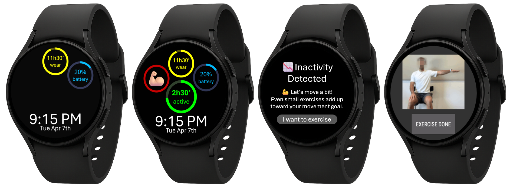
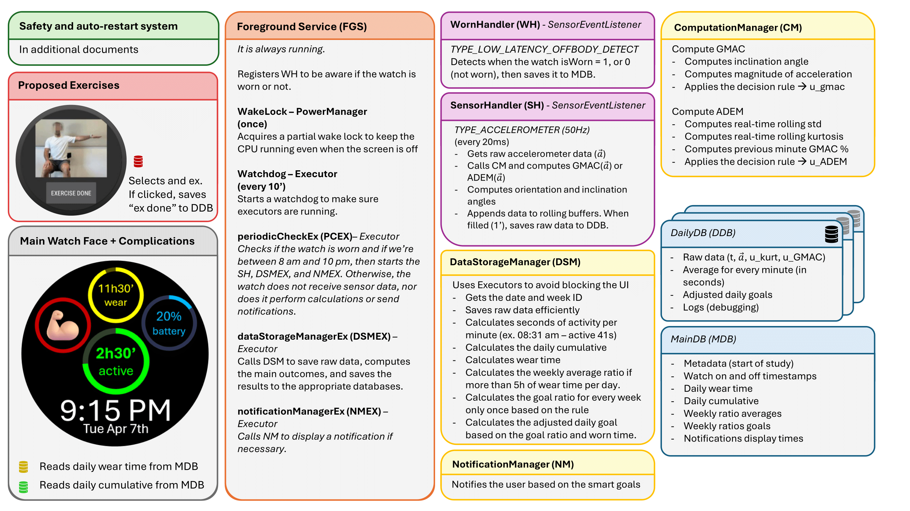
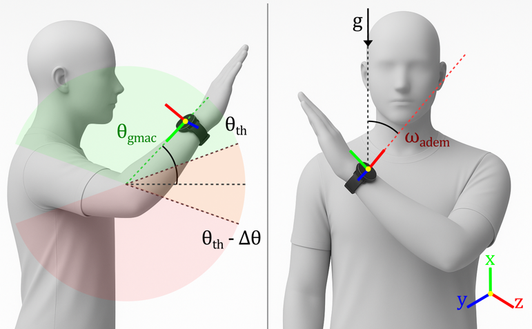
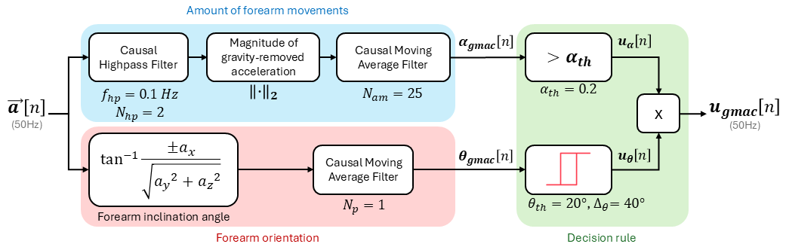
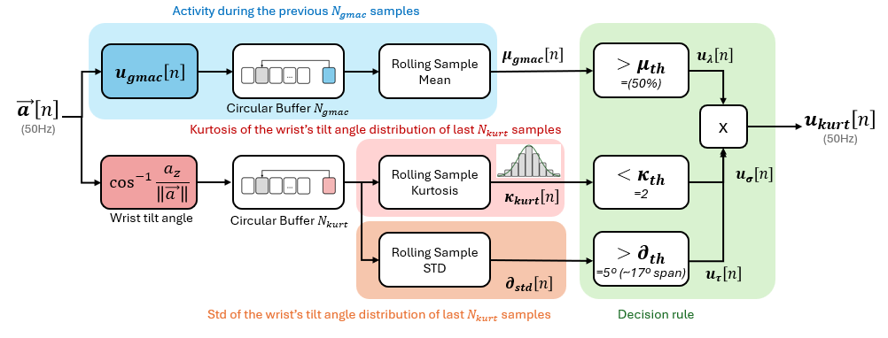
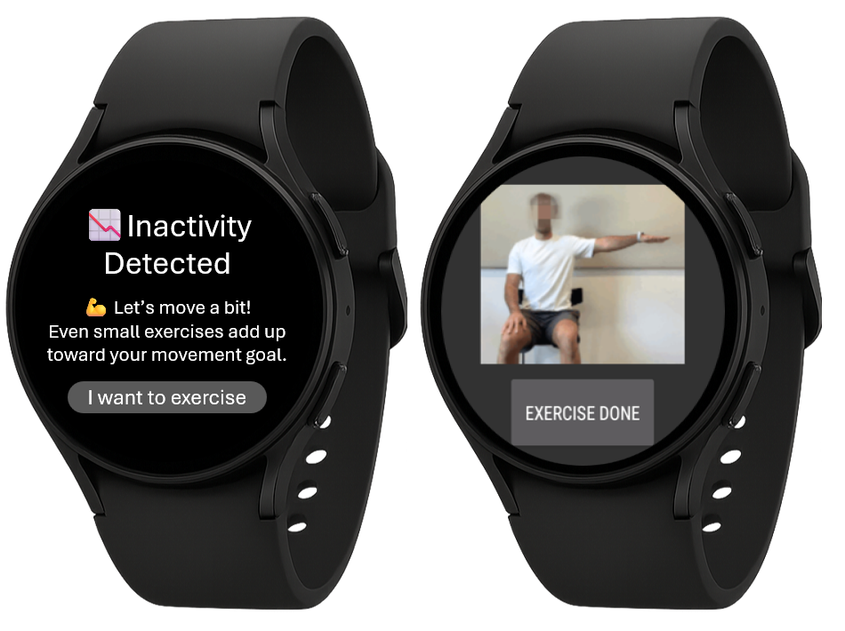
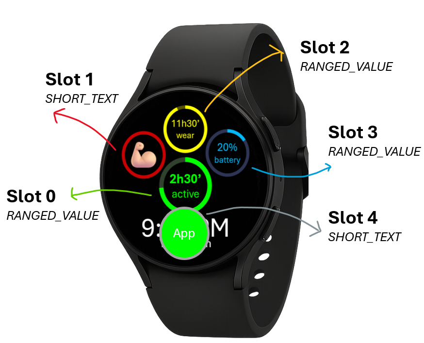

# ⌚ Diversify: A Samsung WearOS App That Encourages Arm Movement
<br>

**Diversify** is a Wear OS app built in Java with Android Studio for robust and continuous arm-movement tracking implemented on Samsung smartwatches.
It measures active time via GMAC and introduces ADEM (Active & Diverse Exploratory Movement), a diversity-focused metric leveraging kurtosis and standard deviation of the wrist-tilt range, in combination with a sustained activity. 
Below is a concise guide to understand the app. This documentation includes recommendations and tips for developers aiming to build similar applications.



---

## 🚀 Main Functionalities
- Detects when the watch is worn.
- If worn, collects accelerometer data at 50 Hz from 8 am to 10 pm.
- Computes wrist orientation and inclination angles, GMAC, and ADEM for every sample in real time.
- Saves raw data and the main outcomes for each day in a daily database using DAO.
- Computes both the cumulative active and diverse times throughout the day.
- Calculates a baseline movement ratio (week 1) to personalize the daily goals for the following weeks.
- Notifies the users when they are below their daily goal (weeks w2, w3, w4, w5) to promote movement after an inactive period.
- Displays the active or diverse daily cumulative arm movement (in minutes) using a custom-made watchface to facilitate usability.

## 📂 Project Characteristics and Structure
- Android Studio Giraffe or newer (AGP 8.x)
- JDK 11+
- Wear OS API 30+ (target 33+ recommended)
- A Wear OS watch or emulator
```
KurtosisStudy
├── app/                # Main Wear OS app (sensing, storage, UI)
├── watchface/          # Custom watch face + complications
├── docs/               # Project docs (markdown) and diagrams
├── gitignore            
├── LICENSE              
└── settings.gradle      
```

## app/

**Main Application (WearOS)**


---

### 🕹️️ MainActivity
* **Boot & start sensing:** launches the foreground sensor service and sets up the main UI.
* **Permissions & power:** requests BODY_SENSORS / notifications and prompts to ignore battery optimizations.
* **Live UI updates:** observes Room LiveData to keep the progress ring and “active time” text current (hides ring on baseline weeks).
* **Complications & reliability:** refreshes complications at startup and schedules a 15-min WorkManager watchdog.
* **Resume sync:** on return, rechecks service liveness and refreshes the UI.
* **Small helpers:** start/stop service, alive check via foreground heartbeat and periodic worker.

### 🎚️ SettingsActivity
* By clicking the "settingsButton" from MainActivity, the user is asked for an admin password, if correct, it opens SettingsActivity
* Lets you change to a new USER_ID and choose the user's handedness. Choosing the appropriate impaired hand side is very important.
* Persists changes to SharedPreferences, shows a toast, stops the FGS, and relaunches the MainActivity to apply these new settings.

### 🔋 ForegroundSensorService (FGS)
* **Foreground & heartbeat:** starts as a sticky foreground service with a persistent notification; writes a heartbeat every 60 s so the app/complication can see it’s alive.
* **Power safety:** acquires a partial WakeLock to keep sensing/loops running with screen off; releases on destroy.
* **Active-hours logic:** only records during 08:00–22:00 and when the watch is worn (via wear detector).
* **Sensors on/off:** starts/stops sensor streaming automatically based on wear state + active-hours.
* **Periodic loops:** minute/second schedulers handle checks, DB work, notifications, and watchdog restarts if any executor dies.
* **Data pipeline:** every minute computes/saves minute stats, updates daily cumulative & wear time; every ~5–10 min adjusts the daily goal; hourly updates weekly metrics/ratios.
* **Notifications & complications:** posts goal/wear reminders and requests updates for progress/service-alive/wear-time complications.
* **Reliability & restart:** watchdog re-inits schedulers; self-restarts on task removal with an alarm fallback on newer Android versions.
* **Cleanup:** on destroy, stops handlers/executors, releases WakeLock, and shuts down sensors cleanly.

### ⌚ WatchWearDetector
* **Initialization:** When the watch is powered on, restarted, or rebooted, it registers the off-body and heart-rate sensors, and saves current wear state using off-body sensor.
* **Start:** On startup, if the wear state is "unknown" and the off-body sensor did not run, it launches a short heart-rate check to determine whether the watch is being worn.
* **Off-body sensor:** The off-body sensor updates the wear state whenever the watch is put on or taken off, while the heart-rate sensor is only used when off-body was not called on FGS start (can happen in some watches).
* **Heart-Rate sensor:** The resolver runs for up to 15 seconds, marking the watch as worn if a valid heart-rate is detected, or not worn if no valid signal appears in time.
* **Apply State:** Whenever the wear state changes, it updates memory and preferences, saves the new state in the database, and logs the result.
* **Stop:** When stopped, it unregisters all sensors and ends any active heart-rate checks.
* **Quick Access:** A method `isWorn()` is available to quickly check if the watch is currently on the wrist.

### 🩺 SensorHandler
* **Role:** Streams accelerometer data at 50 Hz on a dedicated background thread and feeds real-time GMAC/ADEM computations.
* **Initialization:** Starts a `HandlerThread`, sets up the `SensorManager`, and prepares accelerometer access.
* **Start:** Registers the accelerometer listener at 50 Hz, begins filling circular buffers, and logs activation.
* **Processing:** For each sample, saves timestamp + XYZ, computes orientation angle, updates rolling GMAC and kurtosis/STD using online algorithms, and stores all values in 3000-sample circular buffers.
* **Batching:** When the buffer wraps (≈60 s of data), clones all arrays and sends them to `DataStorageManager.snapshotAndSaveBuffers(...)` for async DB storage.
* **Stop & Reset:** Unregisters the sensor, clears buffers and rolling stats safely on the background thread.
* **Shutdown:** Gracefully stops the worker thread (`quitSafely`), waits for completion, and logs the shutdown.

### 🧰 ComputationManager
* **Role:** Streams and scores movement in real time: computes GMAC (active movement) and ADEM (kurtosis + STD + GMAC).
* Angles measured by the watch: 
* **Windowing:** Uses a rolling 3000-sample window (~60 s at 50 Hz) with numerically safe online updates.
* **computeGMAC:** Combines movement (computeActivity: HP-filtered magnitude + moving average) and forearm inclination (computeInclination: with hysteresis). Returns u_gmac flag (1 if active).
* **computeADEM:** Sliding-window std and kurtosis with guards; diversity decision requires: kurtosis < kappa_th, meanGMAC > lambda_th, and stdDeg > angl_th. Returns u_adem flag (1 if diverse)
- GMAC figure: 
- ADEM figure: 

### 🔐 DataStorageManager
* **Role:** Central I/O + analytics layer. Rotates a daily Room DB per date and maintains a cross-day MainResults DB; exposes cached values via SharedPreferences.
* **Init & rotation:** init(ctx) ensures executors, opens MainResultsDatabase, and (re)creates today’s DailyDatabase (User<id>_yyyy_MM_dd). Detects day change with shouldReinitializeDailyDb().
* **Study/Week logic:** Stores study start, computes week number from DB/timezone, mirrors to prefs, and refreshes complications when week changes.
* **snapshotAndSaveBuffers:** Saves raw data when rolling buffer fills to SensorSample.
* **computeAndSaveMinuteAverage:** Computes active and diverse seconds per a given minute (in seconds) and saved to MinuteAverage.
* **computeAndSaveDailyCumulative:** Sums all minutes for today, updates lastKnownProgress, refreshes MyProgressComplicationProviderService, and saves to DailyCumulative.
* **computeAndSaveDailyWearTime:** Uses worn/not-worn session marks from WearSession within 08:00–22:00, refreshes MyWearTimeComplicationProviderService, and updates DailyWearTime.
* **computeAndSaveWeeklyAverage:** Calculates the ratio between active or diverse time with respect to wear time for all that week, and saves to WeeklyAverage.
* **createAndSaveWeeklyRatios:** When a new week is detected, generates a goal ratio for that incoming week, and saves to WeeklyRatio.
* **computeAndSaveAdjustedDailyGoal:** Projects today’s goal from weekly ratio and effective wear time (≥8h floor), updates lastKnownGoal + MyProgressComplicationProviderService, and saves to AdjustedDailyGoal.
* **Quick reads/helpers:** initializeLastKnownProgress(), initializeLastKnownGoal(), getLastNotWornTimestampToday(), getCumulative30MinsBefore(), getActivityDuringPrev30Minutes(), getDayForDB().
* **Reliability:** Single-thread analytics executor with auto-revive; all heavy work off the main thread. shutdown() closes executors/DBs cleanly.

### 🔔 GoalNotificationManager
* **Role:** Organized notification display. Notifies users to wear the watch if it has not being worn, to promote increased wear time. Notifies users if they have been inactive, to promote more movement.
* **notifyIfGoalReached(...) —** Off the UI thread, it estimates expected progress from the last continuous worn run (08:00–22:00), checks inactivity in the past 30 min, then posts a HIGH-importance nudge proposing an exercise action and logs it.
* **notificationIfWatchNotWorn(...) —** After 10:00, if the watch has been off-wrist for ≥30 min and ≥30 min since the last reminder, it posts a friendly “wear me” reminder, records the time, and triggers a 1-second exact alarm as a fallback ping (as notifications are not shown if the user is not wearing the watch).

#### 🙅🏼‍♂️ NotWornAlarmReceiver
* Promoting long periods of wear time is essential, thus when the user has not been wearing the watch for more than 30' a notification pops up. 
* We use an alarm-style alert instead of a normal notification because Wear OS often hides standard notifications when the watch isn’t being worn, so this ensures the user still gets an attention-grabbing prompt.
* Fires from an AlarmManager alarm after the “not worn” threshold of 30', checks ringer/DND state, then (when allowed) plays an alarm sound, vibrates, and shows a high-priority/full-screen notification that opens the app.
 
### 💪🏽 ExerciseActivity
* To motivate users to move more and to give them ideas of beneficial exercises:
* Shows a random exercise GIF (avoiding immediate repeats) and saves its ID and timestamp in SharedPreferences.
* The "Done" button lets the user switch to the next exercises after the exercise has been finished.
* Keeps the screen awake for a ~3-minute window to avoid it turning idle or black.


###  🪵️ LogSaver
* Asynchronously logs messages to Android’s Logcat (level-aware).
* Also saves logs into the app’s Room DailyDatabase. If the daily database isn’t ready/open, it buffers log entries in memory and flushes them to the DB once available.

---

### 💾 Databases
There is a main database, and then an additional database per each new day with the raw data.
```
db
├── MainDB/                         # MainResultsDatabase
│   ├── StudyMetaEntity/            # Stores the start date of the study and timestamp
│   ├── DailyCumulativeEntity/      # Stores the cumulative scores (active and diverse) (in minutes)
│   ├── WearSessionEntity/          # Stores watch worn states (0-not worn, 1-worn)
│   ├── DailyWearTimeEntity/        # Stores the minutes of wear time for a given day
│   ├── NotificationEntity/         # Stores the notifications' timestamps and content   
│   ├── WeeklyAverageEntity/        # Stores the average active/worn time ratio for that week 
│   ├── WeeklyRatioEntity/          # Stores the goal ratio for that week, the goal that should be achieved
├── DailyDB/
│   ├── day1/                       # DailyDatabase
│       ├── SensorSampleEntity/     # Stores IMU raw data, wrist angles, raw kurtosis, raw gmac, u_kurtosis, and u_gmac
│       ├── MinuteAverageEntity/    # Stores the sum of samples per every minute (in seconds). 60 is the max possible value (60s in 1min)
│       ├── AdjustedDailyGoalEntity/    # Stores the adjuested daily goal for a given day based on the goal ratio and wear time
│       ├── LogsEntity/             # Stores the logs for debugging (to check if any problems appear)
│   ├── day2/                       # DailyDatabase
│       ├── SensorSampleEntity/     # same but for the second day...
│   ├── .../                        # an additional db per day
```
### 💿 SharedPreferences
Instead of a db, this app also uses local storage to save variables.
Variable keys are saved in the `PrefsKeys.java` file.
```
SharedPreferences
├── SETTINGS_PREFS/           # Saves the user ID and their handedness (admin write only)
│   ├── USER_ID/              
│   ├── HANDEDNESS/           
├── HEARTBEAT_PREFS/          # Saves the timestamp of each new heartbeat from FGS
│   ├── KEY_HB/               
├── PREFS/                    # Saves data from the DataStorageManager. Main variables from each user's movement.
│   ├── STUDY_START_MS/          
│   ├── LAST_USER_ID/         
│   ├── LAST_CLOUD_UPLOAD_MS/   
│   ├── WEEK_ID/              
│   ├── CURRENT_DB_NAME/      
│   ├── TODAY_DATE/           
│   ├── LAST_KNOWN_PROGRESS/   
│   ├── LAST_KNOWN_GOAL/      
│   ├── LAST_KNOWN_RATIO/     
├── WEAR_PREFS/               # Saves whether the watch is being worn and if wear state is unknown
│   ├── WEAR_STATE/           
│   ├── WEAR_BOOL/            
│   ├── LAST_WEAR_NOTIF/      
├── EXERCISE_PREFS/           # Saves the index from the last shows exercise GIF and time of "done" button press
│   ├── LAST_INDEX/               
│   ├── LAST_SWITCH_MS/       
├── FGS_PREFS/                # Saves some timestamps from the FGS in case it is restarted and needs to remember variables
│   ├── LAST_WEAR_TIME/       
│   ├── LAST_HOURLY_SAVE/     
│   ├── LAST_SENSOR_CHECK/       
│   ├── LAST_BATTERY_CHECK/   
├── NOTIF_PREFS_DATA/         # Saves information from the notifications shown during the intervention weeks
│   ├── LAST_DAY_CHECKED/     
│   ├── GOAL_REACHED_TODAY/   
│   ├── NOTIFS_SHOWED/        
│   ├── LAST_NOTIF_TIME/      
```

### ☁️ CloudStorageActivity + DatabaseUploadWorker (create your own Google Firebase project)
* Reliable, timely cloud uploads let therapists review objective movement data remotely, enabling good remote patient monitoring (RPM) and progress checks.
* CloudStorageActivity shows which databases are pending upload (MAIN + recent days), lets you start an upload, observes the unique WorkManager job to display progress (✅ per item, %).
* It requires Wi-Fi, loads the active USER_ID, lists up to the last 20 days (today + 19), hides database list briefly after success (cooldown), and only uploads days that exist locally and aren’t already in the cloud.
* DatabaseUploadWorker uploads daily zips idempotently using SHA-256 (skips identical); reports item progress for the UI; records last successful upload time; and safely prunes local daily DBs older than 14 days only if the cloud copy exists.
* I used Firebase, so you'll need to create your own cloud project and generate a new `google-services.json` file.

### 🦺 Safety & Service Restarts
The app is built to keep running on its own, so you don’t have to press buttons or manage services. This is especially important for stroke rehabilitation: the less interaction needed, the more accessible and usable the watch is.
Sometimes Android may stop the movement-tracking service (called the ForegroundSensorService, FGS), for example after a reboot, battery restrictions, or system clean-up. To make sure the service always comes back without you needing to do anything, the app uses several layers of safety:

#### 💓 HeartBeatCheckWorker
* MainActivity schedules a unique periodic WorkManager (HeartBeatCheckWorker) every 15 minutes (plus one immediate run) to verify that the ForegroundSensorService (FGS) is alive.
* The FGS writes a heartbeat timestamp every 60 seconds; this worker checks liveness by comparing the last heartbeat age against a TTL of 2 beats.
* If the heartbeat is not expired, it simply refreshes the “service alive” complication and exits.
* If the heartbeat is expired/overdue, it sets isWorn to OFF, flips WEAR_STATE = UNKNOWN, and attempts to start the FGS.
* If Android background restrictions block starting the FGS, it shows a safe (ResumeServiceNotification) to let the user relaunch it.
* This complements START_STICKY and onDestroy() by covering abrupt kills where onDestroy() may not run and ensuring wear state is re-resolved correctly.
* enqueuePeriodic() --> Schedules a repeating run about every 15 min (the minimum). It persists across reboot. Because we used KEEP, later attempts with the same unique name won’t create a second periodic task.
* enqueueNow() --> Also enqueues one run ASAP, but KEEP means if there’s already unfinished work with that unique name, it won’t enqueue another.

#### ▶ ResumeServiceNotification
* This builds a persistent “Tap to resume” notification with a Resume action that directly starts your FGS safely via user interaction.
* Sometimes Wear OS blocks a foreground service from starting automatically, so user interaction (via a notification tap) may be required.

#### 👢 Boot Receiver
* First, BOOT_COMPLETED is set on the Manifest.xml so that the app knows that it has to run the BootReceiver on reboot.
* On reboot, set wear state to STATE_UNKNOWN=-1 (after the watch turns off we don't know if the user took the watch off or kept it on)
* Call HeartbeatCheckWorker immediately to try reopening FGS automatically. Ensure the 15-min periodic HeartbeatCheckWorker exists, even though it should survive reboots.
* As an additional precaution, use an alarm to restart the FGS in case the worker fails. 

#### ⏰ AlarmScheduler & RestartReceiver
* HeartbeatCheckWorker runs through WorkManager, which can be delayed or throttled, especially right after boot or when Android enforces background start limits, then FGS might not be started.
* To cover these cases, the app also calls AlarmScheduler + RestartReceiver o reboot as exact one-shot backstops that recheck liveness and attempt to start the FGS or else show ResumeServiceNotification.

---

## watchface/
Source code for the custom watchface and complications is in this repo:
**https://github.com/gcornella/Diversify_WatchFaceComplications**



###  🛠️️ Complications overview
Although more details are available on the watchface repo, here goes a summary:
For increased usability, 4 complications are shown on a custom-made watchface with the most important metrics, so that users don't have to enter the activity each time they want to see their progress.
* **MyComplicationProviderService:** A clickable complication that opens "ExerciseActivity" to propose active or diverse exercises by showing a GIF animation.
* **MyProgressComplicationProviderService:** Shows a circular ring with the progress (from "DailyCumulative db"), and the max range (from "AdjustedDailyGoal db").
* **MyServiceAliveCheckComplicationProviderService:** Only if service is not running, shows a button that restarts foreground service when clicked.
* **MyWearTimeComplicationProviderService:** Shows a circular ring with the total worn time (from "DailyWearTime db") to motivate users to wear the watch for longer periods. Max is 14h.

---

## 💡 Tips and recommendations
While building this app I encountered a lot of barriers, and I would like to share some of them:

1. **Foreground service randomly stopping (Samsung killing the app)**
  * **Problem:** The ForegroundSensorService would silently stop after some hours, reboots, or when the watch was idle for a long time.
  * **Fix:** Marked the service as `START_STICKY`, added a `BootReceiver` + `HeartBeatCheckWorker` + `AlarmScheduler` + `RestartReceiver` as layered fallbacks, and **asked users to remove the app from Samsung’s “sleeping apps” / battery optimization lists**.

2. **Missed periodic tasks (executors not firing reliably)**
  * **Problem:** `ScheduledExecutorService` tasks (minute/hour loops) would sometimes not run for several minutes.
  * **Fix:** Avoided constantly recreating executors, used a single long-lived scheduler inside the FGS, and added a watchdog that detects “silent minutes” and reinitializes the scheduler when needed.

3. **No sensing when the screen is off / watch idle**
  * **Problem:** Accelerometer callbacks would become unreliable when the display was off or the watch was left idle.
  * **Fix:** Acquired a **partial WakeLock** in the FGS, ran sensor callbacks on a `HandlerThread` (not the main thread), and only stopped sensors explicitly based on wear state and active hours.

4. **Wear detection stuck in UNKNOWN or wrong state**
  * **Problem:** Sometimes the watch started in `UNKNOWN` wear state and never resolved, or off-body sensor didn’t fire on some Samsung models.
  * **Fix:** Implemented `WatchWearDetector` that combines **off-body** and a short **heart-rate-based check** at startup; if off-body never fires, the heart-rate sensor runs up to 15 s to infer worn/not-worn and update `WEAR_PREFS` + DB.

5. **Room database corruption / heavy writes**
  * **Problem:** Large amounts of 50 Hz sensor data caused DB lock issues, slow queries, or potential corruption when writing from multiple threads.
  * **Fix:** Centralized all DB access in `DataStorageManager` using a **single-threaded executor**, **batched writes** (`snapshotAndSaveBuffers()`), and rotated to a **daily DB per day** to keep DB sizes manageable.

6. **Logs crashing when DB not ready**
  * **Problem:** `LogSaver` tried to insert into Room before the DailyDatabase/MainDB were fully initialized → crashes or lost logs.
  * **Fix:** Added an in-memory log buffer: if the DB isn’t ready, logs are queued in memory and **flushed** once `DataStorageManager` reports that the DB is open.

7. **Complications not updating / showing stale progress**
  * **Problem:** Watchface complications sometimes showed old values (progress, wear time, service alive).
  * **Fix:** Called the appropriate `invalidate` / update methods from `DataStorageManager` after each relevant DB write, and ensured the proper `BIND_COMPLICATION_PROVIDER` permission + provider config were set in the manifest.

8. **Wrong days/weeks due to timezone / midnight boundaries**
  * **Problem:** Daily and weekly stats were off by one day in some cases (especially near midnight or with different timezones).
  * **Fix:** Centralized all date handling in `DataStorageManager` (`getDayForDB()`, week calculation) using a **single timezone** and always deriving “today” from the same source that names the daily DB.

9. **Real-time computations too slow (>15 ms per sample)**
  * **Problem:** Naive recomputation of mean, std, and kurtosis over 3000-sample windows was too heavy, risking dropped samples and battery drain.
  * **Fix:** Implemented **online / rolling algorithms** in `ComputationManager` + `SensorHandler` that update mean, M2, M3, M4, kurtosis, and GMAC using previous state + popped values from a circular buffer, logging when processing time exceeded 15 ms.

10. **Difficulty exporting Room databases from Samsung watches**
  * **Problem:** `adb shell run-as ...` scripts often failed (non-debuggable build, permission issues), making it hard to pull DBs for analysis.
  * **Fix:** Used a dedicated **CloudStorageActivity + WorkManager upload** to Firebase (with zipping + SHA-256 check) for hands-off exports, and for local debugging relied on debug builds and simplified `adb` scripts when `run-as` was allowed.
11. **Corrupted DB exports when the watch is low on storage**
  * Problem: Exporting through Wi-Fi (Android Studio device explorer) sometimes produced corrupted `.db` files.
  * Fix: Used direct ADB streaming instead, e.g.:
    ```bash
    adb exec-out run-as com.example.kurtosisstudy cat /data/data/com.example.kurtosisstudy/databases/main.db > main.db
    ```
12. **Watch keeps “worn” state after battery dies**
  * Problem: If the watch powered off while worn, it rebooted still in “worn” state and immediately started collecting data even if not actually worn.
  * Fix: At startup, force wear state to **UNKNOWN** and trigger the wear-detection resolver (off-body + heart-rate) to refresh real wear state.

13. **Incorrect inclination angle for left/right hand**
  * Problem: GMAC inclination uses the X-axis; right/left hands require opposite signs (`-ax` vs `ax`).
  * Fix: Added **handedness settings** stored in SharedPreferences and used them inside GMAC angle computation so active-time detection works correctly on either wrist.

14. **Wi-Fi pairing issues with some protected networks**
  * Problem: Certain corporate/home networks blocked the watch from pairing with Android Studio over Wi-Fi.
  * Fix: Enabling hotspot from an **Android phone** worked reliably; **iPhone hotspots often failed** with Wear OS debugging.

15. **App moving into “sleeping apps” automatically**
  * Problem: Samsung flags unused apps into deep sleep, killing FGS + WorkManager after 1 day of inactivity.
  * Fix: In `Settings → Apps → Your app → Battery`, disabled **“Put app to sleep”** and **“Allow background activity”**, ensuring long-term sensing reliability.

16. **Complications not clickable when overlaid**
  * Problem: Some Wear OS watch faces/Samsung models don’t allow overlapping complications; a large outer ring blocked taps on smaller complications underneath.
  * Fix: Avoided overlaying complications and redesigned the layout so progress rings do not sit on top of interactive providers.

17. **FGS cannot start without user interaction on modern Android**
  * Problem: Auto-starting a foreground service is blocked on Wear OS unless triggered by user input or an approved path.
  * Fix: Added a **button on the watchface** that opens MainActivity, which in turn launches the FGS reliably through user interaction.

---

## 📜 Citation

If using this project in research or development, cite as:

```bibtex
@software{diversify2025,
  title = {Diversify: Providing smart arm movement diversity feedback using a Samsung watch},
  author = {Guillem Cornella-Barba},
  year = {2025},
  url = {https://github.com/gcornella/diversify-smartcoach-wearos}
}
```

---

## 🛟 Support / Contact

For questions, bug reports, or collaborations: **[gcornella15@gmail.com](mailto:gcornella15@gmail.com)** or **[cornellg@uci.edu](mailto:cornellg@uci.edu)**